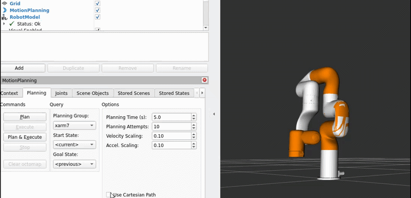

# xArm7-Circle-Motion-Challenge-ROS2-MoveIt2-Demo

This package integrates a custom circular trajectory execution node with the `xarm_ros2` MoveIt 2 configuration. It provides an interactive way to trigger complex autonomous behaviors directly from the RViz graphical interface.

## Table of Contents
1. [Architecture Overview](#architecture-overview)
2. [For Beginners: Understanding the Basics](#for-beginners-understanding-the-basics)
3. [For Senior Developers: Advanced Techniques](#for-senior-developers-advanced-techniques)
4. [How to Run](#how-to-run)

---

## Architecture Overview
The system relies on two primary components:
1. **`start.launch.py`**: A highly customized ROS 2 launch file that dynamically parses Xacro files to construct the URDF/SRDF, injects custom robot states, and initializes the MoveIt 2 planning pipeline alongside fake controllers.
2. **`circle_node.py`**: A reactive Python node that monitors the `/joint_states` topic. When it detects the robot has arrived at a specific "trigger" pose, it computes a parametric circular trajectory and dispatches it to the `/execute_trajectory` action server.

---

## For Beginners: Understanding the Basics

If new to ROS 2 and MoveIt 2, this package demonstrates several foundational concepts:

### 1. ROS 2 Nodes and Topics
The `circle_node.py` is a classic ROS 2 **Node**. It uses a **Subscriber** to listen to the `/joint_states` topic. Think of a topic like a continuous radio broadcast; the robot state publisher constantly broadcasts where the robot's joints are, and  node tunes in to listen.

### 2. MoveIt 2 and RViz
MoveIt 2 is the brain that calculates how the robot arm should move without hitting itself. **RViz** is the 3D visualizer. When see the robot moving on screen, RViz is rendering the joint states calculated by MoveIt.

### 3. The "Trigger" Mechanism
Because RViz's MoveIt panel does not easily accept custom UI buttons, use a clever workaround. Created a named pose (a saved position) called `circle`. Use RViz to tell the robot to move to the `circle` pose. Python node is constantly checking the robot's position. When it sees the robot arrive at the `circle` pose, it waits 2 seconds and then takes over, telling the robot to start spinning in a circle.

---

## For Senior Developers: Advanced Techniques

For experienced roboticists, this package resolves common friction points encountered when dealing with non-standard OEM configurations (like UFactory's `xarm_ros2` package) in ROS 2.
2. Prerequisites & Skills Matrix

LevelRequired KnowledgeSkills Will PracticeBeginnerROS2 basics (nodes, topics, launch files)Subscribing, timers, action clientsBasic Python & YAMLParameter declarationIntermediateMoveIt2 concepts (planning scene, SRDF, OMPL)Trajectory messages, fake controller managerRViz visualizationGoal state selectionSeniorxacro processing, action feedback callbacks, numpy trajectory mathSRDF runtime patching, custom action handling
ROS2 Concepts Covered:

rclpy.node.Node, subscriptions, timers, parameters
Action clients (ExecuteTrajectory)
Launch files with DeclareLaunchArgument and xacro

MoveIt2 Concepts Covered:

move_group node with fake controller
SRDF group states
RobotTrajectory + JointTrajectoryPoint
OMPL planning pipeline (used internally)

RViz Knowledge:

How MoveIt RViz plugin reads robot_description_semantic
Goal State dropdown populated from SRDF <group_state> tags


3. How It Works (Beginner-Friendly)

Launch File Magic (start.launch.py)
Loads official xArm URDF/SRDF
Injects a new “circle” pose directly into the SRDF XML at runtime (no need to edit vendor files)
Starts MoveIt move_group with fake controllers so everything runs in simulation
Launches circle_motion_controller

Circle Node Logic (circle_node.py)
Listens to /joint_states
When all 7 joints are within 0.05 rad of the “circle” pose → trigger
Builds a 120-point sine/cosine trajectory in real time
Sends it via /execute_trajectory action (same action MoveIt uses internally)

Why it feels magical
Never call moveit_commander or plan()
The robot “knows” its own pose from RViz selection.


4. Deep Dive – Senior Developer Technical Details
SRDF Patching Technique
Pythonpatched_srdf = srdf_xml.replace('</robot>', circle_state + '</robot>')
This is a production-grade hack used by many industrial ROS teams when vendor SRDFs are read-only.
Trajectory Generation Math
Pythonp.positions = [
    0.0, -0.4, 0.0,
    0.7 + radius * cos(t),   # J4
    radius * sin(t),         # J5 (primary circle)
    1.1 + radius * sin(t),   # J6
    t                        # J7 full rotation
]

Joint 7 position = t (0 → 2π) works because the fake controller ignores joint limits for continuous joints.
120 points + linear time interpolation = buttery-smooth motion at 10 s duration.

send_goal_async + add_done_callback
Full result/error code handling
Parameterized radius, duration, point count → easy tuning without code change

Fake Controller Integration
The fake_controllers.yaml + moveit_fake_controller_manager lets run full MoveIt pipeline without real hardware – perfect for CI/CD and teaching.

5. Customization & Advanced Features
Easy tweaks (no code change):
Bashros2 launch avatar_challenge start.launch.py circle_radius:=0.5 circle_duration_sec:=15.0
Advanced ideas for seniors:

Replace sine wave with bezier or ROS2 control_msgs trajectory
Add velocity/acceleration fields for real hardware
Convert to MoveIt2 Python planning scene + Cartesian path
Integrate with moveit_task_constructor for multi-step tasks
Add TF visualization of the circle plane
Publish marker array showing the intended circle path in RViz

Skill Upgrades:

To write own MoveGroupInterface plugin
Master JointTrajectoryController for real xArm hardware
Understand planning_scene_monitor and collision checking


6. Troubleshooting
IssueSolution“circle” state missing in RVizRebuild after launch file changesAction server timeoutCheck move_group is running (look for “Planning pipeline” in terminal)Jerky motionIncrease points parameterJoint 7 wraps incorrectly on real hardwareAdd continuous: true in URDF joint7

  Dynamic SRDF Injection
MoveIt's UI reads saved states from the Semantic Robot Description Format (SRDF). Standard practice requires modifying the OEM's XML files directly, which is bad for version control and updates. Instead, `start.launch.py` uses python string manipulation to dynamically inject a `<group_state>` into the compiled SRDF at runtime:
```python
patched_srdf = srdf_xml.replace('</robot>', custom_goal_states + '</robot>')
This ensures the custom pose appears natively in the RViz MotionPlanning Qt panel without touching the upstream source.2. Bypassing MoveItConfigsBuilderThe standard MoveItConfigsBuilder assumes a strict directory structure (e.g., config/kinematics.yaml). The xarm package nests these under config/xarm7/. Instead of failing out, the launch file utilizes a custom load_yaml and process_xacro pipeline to explicitly map the nested configurations to MoveIt's required parameter dictionaries (e.g., robot_description_kinematics).3. Action Client Trajectory ExecutionPublishing directly to a fake controller's JointTrajectory topic often results in dropped messages or lack of visualization in RViz. To guarantee execution and visualization, circle_node.py acts as an Action Client to /execute_trajectory.4. Trajectory Generation MathThe trajectory bypasses Cartesian IK planning to avoid singularities, instead operating purely in Joint Space. By modulating joints 4, 5, and 6 with sine/cosine waves while sweeping joint 7 from $0$ to $2\pi$, we create an end-effector path that mimics a spatial circle:$J_4(t) = 0.7 + 0.3 \cos(t)$$J_5(t) = 0.4 \sin(t)$$J_6(t) = 1.1 + 0.3 \sin(t)$

---

## How to Run Build
 the workspace:Bashcd ~/dev_ws
colcon build --packages-select avatar_challenge
Source the setup script:Bashsource install/setup.bash
Launch the environment:Bashros2 launch avatar_challenge start.launch.py
Trigger the Motion:In RViz, navigate to the MotionPlanning panel.Under the Planning tab, locate the Goal State drop-down.Select circle.Click Plan and Execute.Wait for the arm to reach the pose; the Python node will automatically initiate the circular motion 2 seconds later.
